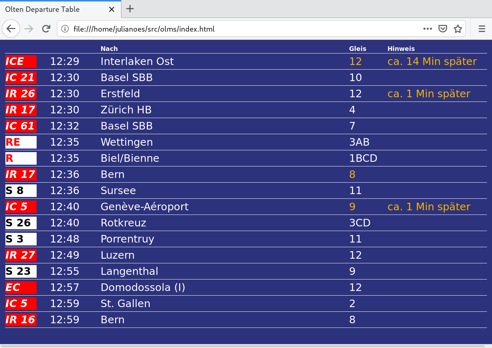

# olms

My own Olten departure table in Elm

Build it:
```
elm make src/Main.elm --output=main.js
```

Deploy it:
```
scp index.html styles.css main.js pi@<my Raspberry Pi's IP>:
```

Developed with elm 0.19.1.

The API used is: https://timetable.search.ch/api/help#stationboard



## Kiosk mode for Raspberry Pi

Instructions to enable the kiosk mode on a Raspberry Pi using chromium.

1. Install requirements: `sudo apt-get install xdotool unclutter sed chromium-browser`.
2. Copy [kiosk.sh](kiosk/kiosk.sh) to `/home/pi/kiosk.sh`.
3. Copy [kiosk.service](kiosk/kiosk.service) to `/lib/systemd/system/kiosk.service`.
4. Start kiosk service: `sudo systemctl start kiosk.service`.
5. Enable kiosk service: `sudo systemctl enable kiosk.service`.
